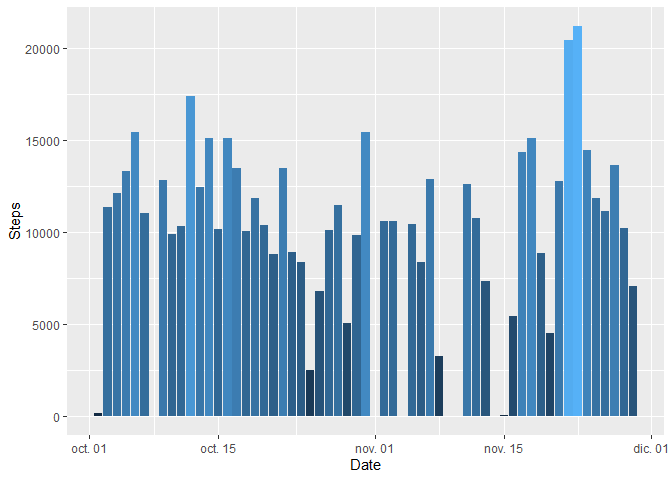
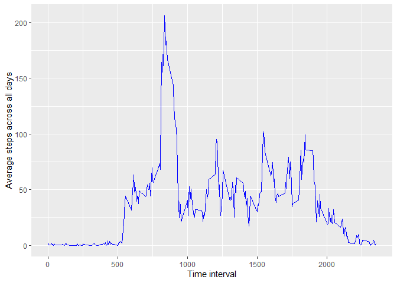
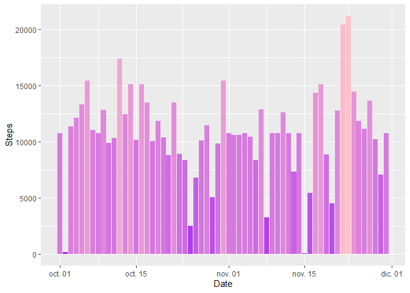

## Loading and preprocessing the data
##### 1. Load the data (i.e. read.csv())

```r
if(!file.exists('activity.csv')){
    unzip('activity.zip')
}
activityData <- read.csv('activity.csv')
```
##### 2. Process/transform the data (if necessary) into a format suitable for your analysis

```r
activityData$date<-as.Date(as.character(activityData$date,"%Y-%m-%d"))
```

-----

## What is mean total number of steps taken per day?

```r
#Calculate the total steps per day
stepsPerDay <- aggregate(steps~date,data=activityData,sum,na.rm=TRUE)
```

##### 1. Make a histogram of the total number of steps taken each day

```r
ggplot(stepsPerDay,aes(date,steps,fill=steps))+geom_bar(stat="identity")+labs(y="Steps",x="Date")+
guides(fill=FALSE)
```

<!-- -->

##### 2. Calculate and report the mean and median of the total number of steps taken per day


```r
#Calculate the mean of steps
meansteps<-mean(stepsPerDay$steps)

#Calculate the median of steps
mediansteps<-median(stepsPerDay$steps)
```
The mean total number of steps per day is 1.0766189\times 10^{4} and the median is 10765.

## What is the average daily activity pattern?

##### 1. Make a time series plot (i.e. type = "l") of the 5-minute interval (x-axis) and the average number of steps taken, averaged across all days (y-axis)


```r
series <- aggregate(steps~interval,data=activityData,mean,na.rm=TRUE)

ggplot(data=series, aes(x=interval,y=steps))+geom_line(color="blue")+labs(y="Average steps across all days",x="Time interval")
```

<!-- -->

##### 2. Which 5-minute interval, on average across all the days in the dataset, contains the maximum number of steps?


```r
maxsteps<-max(series$steps)
maxstepsindex<-which(series$steps==maxsteps)
maxstepsinterval<-c(series[maxstepsindex,1],series[maxstepsindex+1,1])
```
The maximum number of steps for an interval across all days is 206.1698113 and is obtained in the [835, 840) interval.

## Imputing missing values
Note that there are a number of days/intervals where there are missing values (coded as NA). The presence of missing days may introduce bias into some calculations or summaries of the data.

##### 1. Calculate and report the total number of missing values in the dataset (i.e. the total number of rows with NAs)


```r
numna<-sum(!complete.cases(activityData))
```
There are 2304 missing values in the dataset

##### 2. Devise a strategy for filling in all of the missing values in the dataset. The strategy does not need to be sophisticated. For example, you could use the mean/median for that day, or the mean for that 5-minute interval, etc.

##### 3. Create a new dataset that is equal to the original dataset but with the missing data filled in.


```r
nacases<-which(!complete.cases(activityData)==TRUE)
imputeData <- activityData

for (i in nacases) {
  imputeData[i,1]<- series[which(series$interval==imputeData[i,3]),2]
}
```

##### 4. Make a histogram of the total number of steps taken each day and Calculate and report the mean and median total number of steps taken per day. Do these values differ from the estimates from the first part of the assignment? What is the impact of imputing missing data on the estimates of the total daily number of steps?


```r
#Calculate the total steps per day
stepsPerDay2 <- aggregate(steps~date,data=imputeData,sum,na.rm=TRUE)

#Create the histogram
ggplot(stepsPerDay2,aes(date,steps,fill=steps))+geom_bar(stat="identity")+labs(y="Steps",x="Date")+
guides(fill=FALSE) +scale_fill_gradient(low="purple", high="pink")
```

<!-- -->

```r
meansteps2<-mean(stepsPerDay2$steps)

#Calculate the median of steps
mediansteps2<-median(stepsPerDay2$steps)
```

The mean total number of steps per day is 1.0766189\times 10^{4} and the median is 10765 on the raw data, and it is 1.0766189\times 10^{4} and 1.0766189\times 10^{4}, respectively, showing that imputing did not significantly affect these estimates. The daily number of steps slightly increases for those days for which no data was available.

## Are there differences in activity patterns between weekdays and weekends?

##### 1. Create a new factor variable in the dataset with two levels -- "weekday" and "weekend" indicating whether a given date is a weekday or weekend day.


```r
imputeData[,4]<-weekdays(imputeData[,2])
names(imputeData)<-c("steps","date","interval","weekday") 
for (i in 1:length(imputeData[,4])){
  if(imputeData[i,4] == "sabado" | imputeData[i,4] == "domingo")
    {imputeData[i,4]<-"Weekend"}else{imputeData[i,4]<-"Weekday"}
}
```

##### 2. Make a panel plot containing a time series plot (i.e. type = "l") of the 5-minute interval (x-axis) and the average number of steps taken, averaged across all weekday days or weekend days (y-axis).:


```r
stepsPerWeekdayWeekend <- aggregate(steps~interval+weekday,data=imputeData,mean,na.rm=TRUE)
ggplot(stepsPerWeekdayWeekend,aes(x=interval,y=steps,color=weekday))+facet_grid(weekday~.,space="free")+
geom_line()+guides(color=FALSE)
```

<!-- -->
